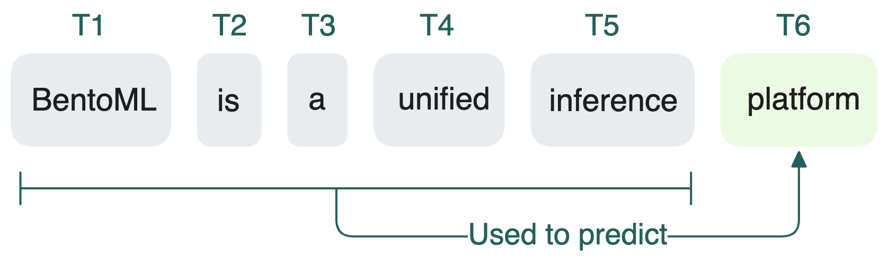

Во время инференса LLM генерирует текст по одному токену, используя внутренние механизмы внимания и знание предыдущего контекста.

## Что такое токены и токенизация?

Токен — это минимальная единица языка, которую LLM использует для обработки текста. Это может быть слово, часть слова или даже символ, в зависимости от токенизатора. У каждой LLM свой токенизатор и алгоритм токенизации. Токенизация — это процесс преобразования входного текста (например, предложения или абзаца) в токены. Затем токены преобразуются в идентификаторы, которые передаются модели во время инференса.

Вот пример токенизации предложения `BentoML supports custom LLM inference.` с помощью [токенизатора GPT-5.x](https://platform.openai.com/tokenizer):

```bash
Tokens: "B", "ento", "ML", " supports", " custom", " L", "LM", " inference", "."

Token IDs: [33, 13969, 4123, 17203, 2602, 451, 19641, 91643, 13]
```

Для вывода LLM генерирует новые токены авторегрессивно. Начиная с начальной последовательности токенов, модель предсказывает следующий токен на основе всего, что было до этого. Этот процесс повторяется до достижения условия остановки.

## Две фазы инференса LLM

Для моделей на трансформерах, таких как GPT-4, весь процесс инференса делится на две фазы: **prefill и decode**.

### Prefill

Когда пользователь отправляет запрос, токенизатор LLM преобразует его в последовательность токенов. Фаза prefill начинается после токенизации:

1. Эти токены (или их ID) преобразуются в числовые векторы, которые LLM может понимать.
2. Векторы проходят через несколько слоёв трансформера, каждый из которых содержит механизм self-attention. Для каждого токена вычисляются векторы query (Q), key (K) и value (V). Эти векторы определяют, как токены «внимательно» относятся друг к другу, формируя контекст.
3. По мере обработки запроса модель строит KV-кэш, где хранятся ключи и значения для каждого токена на каждом слое. Это внутренняя память для ускорения поиска во время декодирования.

На этапе prefill весь запрос (вся последовательность входных токенов) уже доступен до начала вычислений. Это позволяет LLM обрабатывать все токены одновременно с помощью параллельных матричных операций, особенно в attention.

В результате prefill — вычислительно затратная фаза, часто полностью загружает GPU. Реальная загрузка зависит от длины последовательности, размера батча и характеристик оборудования.

Важная метрика для prefill — Time to First Token (TTFT), время от отправки запроса до генерации первого токена. Подробнее об этом — в главе [оптимизация инференса](/inference-optimization).


### Decode

После prefill LLM переходит к фазе decode, где генерирует новые токены последовательно, по одному.


Для каждого нового токена модель выбирает из вероятностного распределения, сформированного на основе запроса и всех ранее сгенерированных токенов. Этот процесс авторегрессивный: токены T₀ до Tₙ₋₁ используются для генерации токена Tₙ, затем T₀ до Tₙ — для Tₙ₊₁ и так далее.



Каждый новый токен добавляется к растущей последовательности. Этот авторегрессивный цикл продолжается до:

- достижения максимального лимита токенов,
- генерации стоп-слова,
- появления специального токена конца последовательности (например, `<end>`).

В конце последовательность токенов декодируется обратно в читаемый текст.

В сравнении с prefill, decode больше зависит от памяти, так как часто обращается к растущему KV-кэшу. KV-кэш хранит ключи и значения в памяти, чтобы при генерации новых токенов LLM вычисляла их только для новых токенов, а не для всей последовательности.

Этот механизм KV-кэширования значительно ускоряет инференс, избегая лишних вычислений. Но он увеличивает потребление памяти, так как кэш растёт с длиной генерируемой последовательности.

Важная метрика для decode — Inter-Token Latency (ITL), время между генерацией последовательных токенов.


### Совместное выполнение prefill и decode

Традиционные системы обслуживания LLM обычно запускают обе фазы — prefill и decode — на одном оборудовании. Это вызывает ряд проблем.

Главная — взаимное влияние фаз: они не могут работать полностью параллельно. В продакшене одновременно могут приходить несколько запросов, у каждого свои фазы prefill и decode, которые пересекаются между собой. Но одновременно может работать только одна фаза. Когда GPU занят вычислениями prefill, decode ждёт, увеличивая задержку токенов, и наоборот. Это затрудняет планирование ресурсов.

Открытое сообщество активно разрабатывает стратегии разделения prefill и decode. Подробнее см. [дисагрегация prefill-decode](/inference-optimization/prefill-decode-disaggregation).

## Что такое контекстное окно и как оно работает в инференсе LLM?

Контекстное окно — это количество токенов, которое LLM может обработать за один инференс. Оно включает всю историю диалога, которую нужно отправлять заново при каждом запросе для сохранения связности.

Технически у LLM нет настоящей памяти. Чтобы сохранить контекст, каждый новый запрос должен пересылать все предыдущие сообщения, чтобы модель «видела» всю историю снова (это происходит незаметно для пользователя). То есть связность поддерживается путём реконструкции контекста через входной запрос каждый раз.


Этот текстовый «исторический» контекст называется контекстным окном, у которого есть максимальная длина (например, 8K, 32K или 128K токенов).

Как упоминалось выше, LLM использует KV-кэш предыдущих токенов, чтобы не перерабатывать всё заново на этапе decode, что помогает снизить задержку. При повторном использовании KV-кэша для нескольких запросов это точнее называть [кэшированием префикса](../inference-optimization/prefix-caching).


## Диффузионные LLM (dLLM)

Как уже говорилось выше, большинство современных LLM авторегрессивные — они генерируют текст по одному токену. Такой последовательный процесс — естественное узкое место: медленно и дорого.

Диффузионные LLM (dLLM) меняют этот подход. Они выдают весь ответ параллельно через процесс «очистки шума», вдохновлённый генерацией изображений (например, Stable Diffusion).

Основная идея:

1. Модель начинает с облака шума, представляющего грубый набросок возможных ответов.
2. Через несколько шагов очистки шума постепенно превращает его в связанный текст.
3. Финальный ответ появляется сразу, как изображение, которое становится чётким.

Параллельный процесс устраняет узкое место по токенам. dLLM могут итеративно самоисправляться во время генерации, что делает их особенно сильными для задач редактирования, мат. рассуждений и автодополнения кода.

Ранние примеры dLLM:

- [Mercury](https://x.com/_inception_ai/status/1894847919624462794) от Inception AI: заявлено, что инференс до 10× быстрее и эффективнее традиционных LLM.
- [Gemini Diffusion](https://deepmind.google/models/gemini-diffusion/) от Google DeepMind: ранние эксперименты применения диффузии к генерации текста. Доступен как экспериментальный демо для развития будущих моделей.

Концепция пока на ранней стадии. Фреймворки инференса вроде vLLM пока не поддерживают dLLM, но идут [активные обсуждения](https://github.com/vllm-project/vllm/issues/18532) будущей интеграции.

Пока авторегрессивные LLM остаются основным архитектурным стандартом. Но dLLM — одно из самых перспективных направлений для следующего поколения инференса. Если вы работаете с авторегрессивными LLM, стоит следить за развитием dLLM.

## Дополнительные ресурсы
>  * [DistServe: Disaggregating Prefill and Decoding for Goodput-optimized Large Language Model Serving](https://arxiv.org/abs/2401.09670)
>  * [Large Language Diffusion Models](https://arxiv.org/abs/2502.09992)
