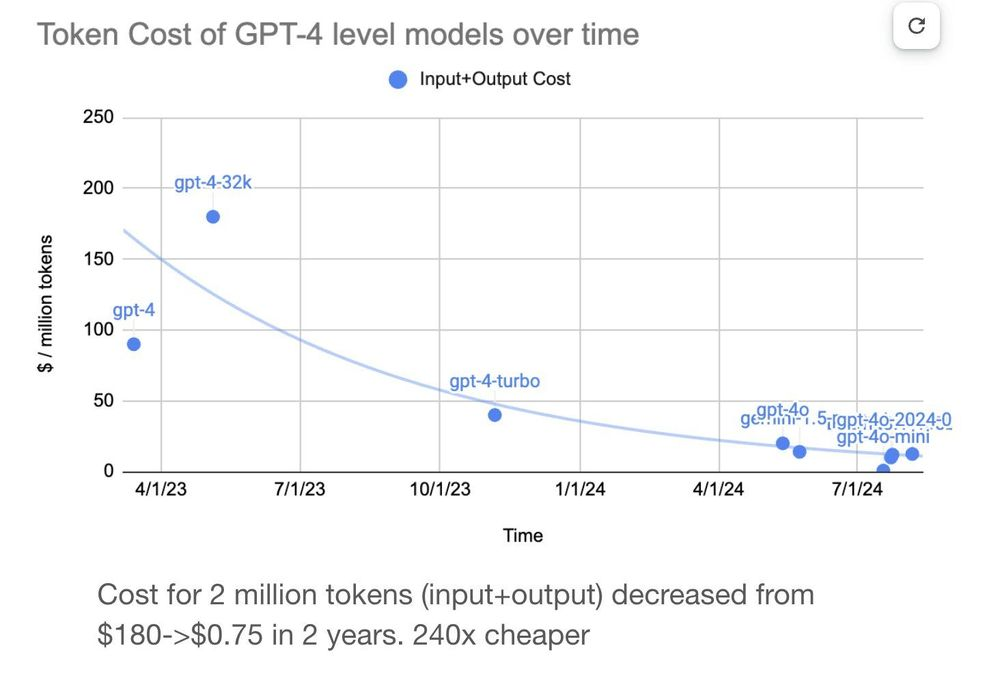

При создании приложений с LLM обычно есть два варианта инфраструктуры: **serverless** (управляемые API) и **self-hosted** решения. Каждый вариант имеет свои плюсы и минусы по удобству, кастомизации, масштабируемости и соответствию требованиям.

## Serverless LLM inference

Serverless-сервисы инференса, такие как OpenAI, Anthropic и другие API-платформы, сильно упрощают разработку. Они берут на себя всю инфраструктуру, позволяя платить только за использование.

Эти сервисы работают не только на проприетарных моделях (например, GPT-5 или Claude-Sonnet-4.5). Открытые модели, такие как DeepSeek-R1 и Llama 4, тоже доступны через serverless-эндпоинты на платформах типа Together AI и Fireworks.

Основные преимущества serverless API:

- **Простота**: Можно быстро начать с минимальной настройкой — нужен только API-ключ и несколько строк кода. Не требуется управлять железом, окружением или сложной логикой масштабирования.
- **Быстрое прототипирование**: Отлично подходит для тестирования идей, создания демо или внутренних инструментов без инфраструктурных затрат.
- **Абстракция железа**: Для self-hosted LLM в масштабе обычно нужны топовые GPU (например, NVIDIA A100 или H100). Serverless API скрывают эти сложности, позволяя избежать дефицита GPU, лимитов и задержек при выделении ресурсов.

## Self-hosted LLM inference

Self-hosted инференс — это развёртывание и управление собственной инфраструктурой LLM (в облаке, VPC или на своих серверах). Это даёт полный контроль над развертыванием, оптимизацией и масштабированием моделей — важно для долгосрочного конкурентного преимущества.

Основные плюсы self-hosting:

- **Приватность данных и комплаенс**: LLM широко используются в современных приложениях (RAG, AI-агенты), где часто нужен доступ к чувствительным данным (клиенты, медицина, финансы). Для организаций с требованиями к комплаенсу и приватности self-hosting гарантирует, что данные остаются в безопасной среде.
- **Гибкая кастомизация и оптимизация**: Можно точно настраивать инференс под свои задачи:
    - Тонко регулировать баланс задержки и пропускной способности.
    - Внедрять продвинутые оптимизации: [дисагрегация prefill-decode](../inference-optimization/prefill-decode-disaggregation), [кэширование префикса](../inference-optimization/prefix-caching), [спекулятивное декодирование](../inference-optimization/speculative-decoding).
    - Оптимизировать для длинных контекстов или [batch-processing](../inference-optimization/static-dynamic-continuous-batching).
    - Применять структурированное декодирование для строгих схем вывода.
    - [Дообучать модели](../getting-started/llm-fine-tuning) на собственных данных для конкурентного преимущества.
- **Предсказуемая производительность и контроль**: При self-hosting вы полностью контролируете поведение и производительность системы. Нет зависимости от внешних лимитов API или внезапных изменений политики, которые могут повлиять на работу приложения.

## Сводная таблица

Выбор между serverless и self-hosted инференсом зависит от ваших задач: удобство, приватность, оптимизация, контроль.

| Параметр | Serverless API | Self-hosted инференс |
| --- | --- | --- |
| **Удобство** | ✅ Высокое (простые API-вызовы) | ⚠️ Ниже (нужно развёртывание и поддержка LLM) |
| **Приватность и комплаенс** | ⚠️ Ограничено | ✅ Полный контроль |
| **Кастомизация** | ⚠️ Ограничено | ✅ Полная гибкость |
| **Стоимость при масштабе** | ⚠️ Выше (зависит от объёма, быстро растёт) | ✅ Потенциально ниже (предсказуемая, оптимизированная инфраструктура) |
| **Управление железом** | ✅ Абстрагировано | ⚠️ Требует настройки и поддержки GPU |

## Как считать стоимость

В serverless API стоимость за токен фиксирована, но итоговые расходы растут линейно с использованием. Это удобно для прототипов, но быстро становится дорого в продакшене.

В self-hosting больше работы и инфраструктурных затрат на старте, но стоимость за токен сильно падает с ростом объёма, особенно при оптимизации инференса (например, [выгрузка KV-кэша](../inference-optimization/kv-cache-offloading)).

На разных этапах внедрения AI стоит пересматривать подход и балансировать между гибкостью и контролем.

Важно: оба варианта (serverless и self-hosted) становятся дешевле со временем благодаря:

- Постоянному снижению цен на API из-за конкуренции (например, OpenAI заметно снизил стоимость токенов, см. картинку ниже).

- Железо (GPU) становится эффективнее и доступнее.
- Проекты вроде vLLM и SGLang повышают эффективность инференса.
- Открытые модели требуют меньше ресурсов благодаря новым оптимизациям.

Подробнее: [Serverless vs. Dedicated LLM Deployments: анализ стоимости](https://www.bentoml.com/blog/serverless-vs-dedicated-llm-deployments).

## Когда начинать с serverless и когда брать контроль

Если вы только начинаете с LLM, serverless API — отличный способ быстро стартовать. Прототипирование становится простым, входной порог низкий, можно быстро проверить гипотезы без инфраструктуры.

Но эта простота имеет свои ограничения. По мере роста AI-кейсов и требований к производительности, приватности и уникальности, ограничения serverless становятся заметнее.

Почему? Для серьёзных AI-продуктов важна не только модель, но и слой инференса — именно он «оживляет» модель. Если полагаться только на сторонние API, приложение быстро запустится, но не даст долгосрочного контроля и конкурентного преимущества. В отличие от self-hosted, serverless API сложно тонко настраивать по производительности и стоимости — вы просто вызываете тот же API, что и все остальные. Отсутствие кастомизации мешает строить устойчивое преимущество:

1. **Композитные AI-системы** — так выигрывают топовые команды. [Они связывают несколько моделей и инструментов в гибкие рабочие процессы](https://www.bentoml.com/blog/a-guide-to-compound-ai-systems).
2. **Собственные инференс-стэки** позволяют проектировать точные SLA и стоимость для разных задач.
3. **Дообученные и кастомные модели** дают точность и защиту IP, которых нет у универсальных API.

В итоге, **качество инференса = качество продукта**. Если AI — критически важная часть, нужна инфраструктура, которая быстрая, надёжная, безопасная и заточена под ваши цели.

Вот тогда пора выходить за рамки API и брать инференс под свой контроль.

## Что нужно решить при выборе self-hosting?

Self-hosting LLM даёт полный контроль и гибкость, но требует дополнительных усилий:

- **DevOps-время на настройку и поддержку**: инфраструктура, деплой, стабильная работа.
- **Мониторинг и алерты**: наблюдаемость (включая метрики LLM, такие как TTFT и TPS), отслеживание производительности, отказов, SLA.
- **Затраты на передачу и хранение данных**: большие файлы моделей, облачный трафик, дисковые операции.
- **Риски простоев и резервирования**: высокая доступность, планирование отказоустойчивости.
- **Медленные cold start**: запуск GPU-инстансов, загрузка контейнеров LLM, подгрузка весов. Оптимизация старта критична для масштабирования в реальном времени.

Но не обязательно всё строить с нуля. Платформа инференса поможет снизить эти затраты и операционные риски, сделав self-hosting более выгодным.

---

## Частые вопросы

### Что значит self-hosted AI?

self-hosted AI — это запуск и управление AI-моделями на собственной инфраструктуре (например, дата-центры, приватное облако, выделенные GPU-серверы).

При self-hosting вы полностью контролируете приватность данных, настройку производительности и оптимизацию затрат. Это полезно для команд, которым нужно:

- Развёртывать открытые модели (например, DeepSeek-R1)
- Кастомизировать модели с помощью специальных оптимизаций
- Дообучать модели на собственных данных
- Соблюдать внутренние требования по комплаенсу и хранению данных

### Проприетарные модели мощнее открытых?

Не всегда. Всё зависит от задач.

Проприетарные модели часто лидируют по универсальному мышлению, коду и качеству диалога — они обучены на огромных датасетах и доработаны сложными техниками согласования. Это хороший выбор, если нужна высокая производительность «из коробки» без инфраструктуры.

Открытые модели (Llama, Qwen, DeepSeek) дают больше контроля, прозрачности и гибкости. Их можно дообучать, развёртывать где угодно, оптимизировать по задержке и стоимости. Разрыв между открытыми и проприетарными моделями быстро сокращается, особенно для узкоспециализированных задач.

Например, если дообучить открытую LLM на собственных данных (юридические, медицинские, финансовые), она может превзойти проприетарные модели в этой области. Такой подход нужен многим индустриям.

## Дополнительные ресурсы
>  * [Secure and Private DeepSeek Deployment with BentoML](https://www.bentoml.com/blog/secure-and-private-deepseek-deployment-with-bentoml)
>  * [Serverless vs. Dedicated LLM Deployments: анализ стоимости](https://www.bentoml.com/blog/serverless-vs-dedicated-llm-deployments)
>  * [Building RAG Systems with Open-Source and Custom AI Models](https://www.bentoml.com/blog/building-rag-with-open-source-and-custom-ai-models)
>  * [ChatGPT Usage Limits: What They Are and How to Get Rid of Them](https://www.bentoml.com/blog/chatgpt-usage-limits-explained-and-how-to-remove-them)
