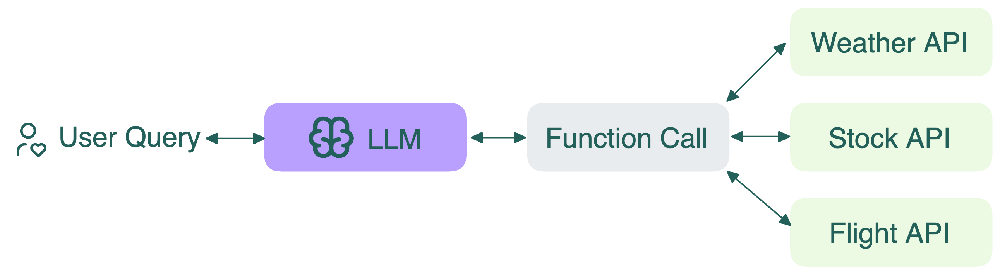

Function calling (вызов функций) — это как если бы у LLM был набор инструментов, которыми она может воспользоваться для помощи вам. Когда вы просите модель сделать что-то, для чего нужен инструмент, она может «вызвать» соответствующую функцию.

Пример:

- **Вы спрашиваете**: «Какая сейчас цена акции Apple?»
- **LLM думает**: «Мне нужны актуальные данные, вызову функцию получения цены»
- **LLM вызывает**: `get_stock_price("AAPL")`
- **Функция возвращает**: "$195.25"
- **LLM отвечает**: «Текущая цена акции Apple — $195.25»

Технически LLM по-прежнему предсказывает следующий токен, как и любая другая трансформер-модель. В prompt включаются чёткие сигнатуры и описания функций, что направляет модель на генерацию подходящих форматов. Это позволяет строить такие сценарии, как:

- Вызов API по пользовательскому запросу
- Запуск действий (например, отправка email, получение погоды)
- Передача результатов обратно в модель для диалога в несколько шагов

## Часто задаваемые вопросы (FAQ)

### Чем отличается function calling от структурированных ответов?

Эти понятия часто путают. Кратко:

- Структурированные ответы: вы задаёте [формат, в котором модель отвечает](./structured-outputs). Например, можно заставить модель выдавать JSON, список или объект.
- Function calling: вы указываете, когда нужно выполнить действие. Инструменты для function calling обычно тоже описываются структурированно (например, в JSON).

Оба подхода можно использовать вместе.

### Все ли LLM поддерживают function calling?

Не все, но многие современные модели — да. Open-source модели вроде Llama, Qwen, DeepSeek хорошо работают с vLLM или SGLang.

### Является ли function calling тем же, что tools или агенты?

Tools — это действия. Function calling — способ, которым модель запрашивает эти действия. Агенты — это системы, которые используют function calling в цикле с рассуждением: они могут планировать, вызывать несколько инструментов по очереди, оценивать результаты и корректировать стратегию.

## Дополнительные ресурсы
  * [Function Calling with Open-Source LLMs](https://bentoml.com/blog/function-calling-with-open-source-llms)
