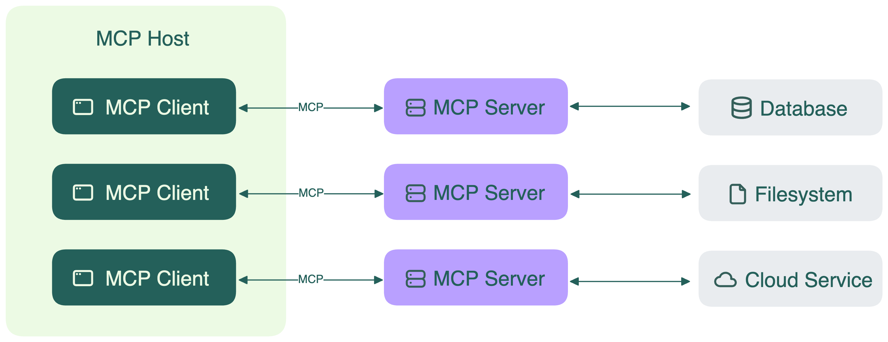

[Model Context Protocol (MCP)](https://modelcontextprotocol.io/introduction) — это открытый стандарт коммуникации, который позволяет AI-ассистентам подключаться к различным внешним сервисам и источникам данных.

MCP использует архитектуру клиент-сервер со следующими компонентами:

- **MCP host**: место, где «живет» AI-ассистент. Это может быть чат-приложение (например, Claude Desktop), IDE-помощник или любое другое AI-приложение. В одном host может быть один или несколько MCP-клиентов.
- **MCP clients**: низкоуровневая реализация внутри host, поддерживающая индивидуальные соединения с MCP-серверами.
- **MCP servers**: коннекторы, предоставляющие различные возможности и доступ к данным. Каждый сервер может подключаться к разным backend-источникам: базы данных, сторонние API, репозитории GitHub, локальные файлы и т.д. На одной машине может работать несколько серверов, а также возможны подключения к удалённым сервисам.
- **MCP protocol**: транспортный слой, обеспечивающий связь между host и серверами, независимо от их количества.

Когда AI-ассистенту нужно получить доступ к внешним данным или инструментам, процесс выглядит так:

1. MCP host отправляет запрос через MCP protocol
2. Соответствующий MCP server получает запрос
3. Сервер подключается к реальному источнику данных (БД, API, файловая система и т.д.)
4. Сервер обрабатывает запрос и возвращает данные через протокол
5. AI-ассистент получает информацию и использует её в ответе