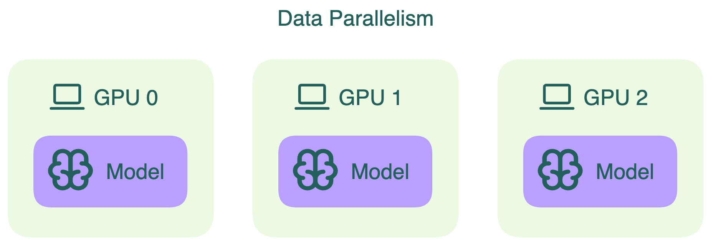
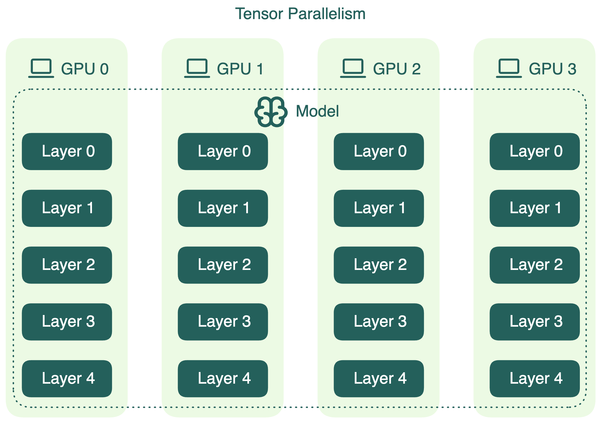
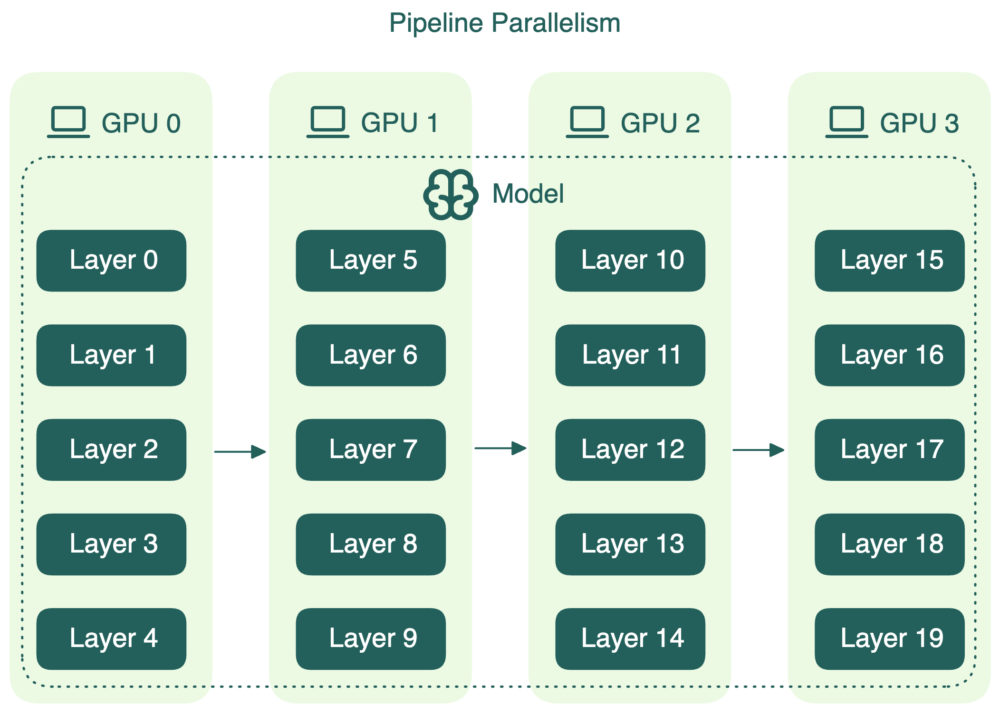
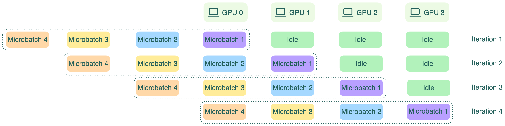
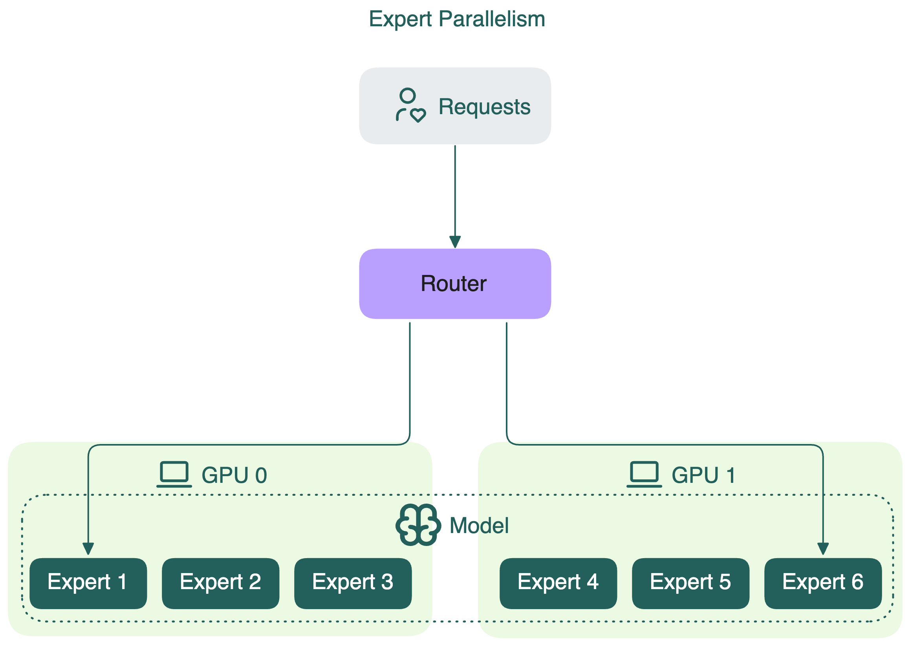
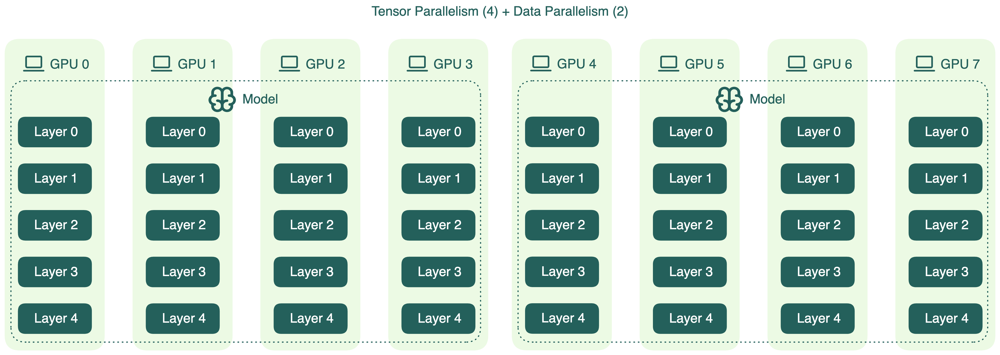
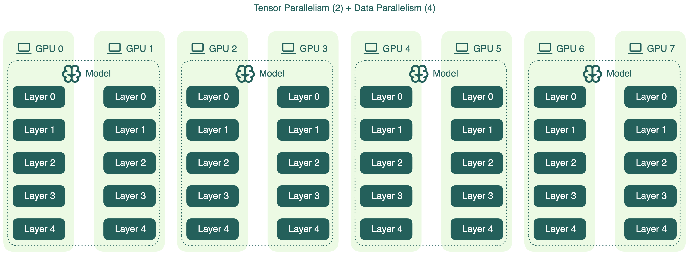

Стратегии параллелизма — основа высокопроизводительных вычислений в современных AI-системах. Они позволяют распределять задачи между устройствами, повышая эффективность, снижая стоимость и увеличивая пропускную способность. По мере роста моделей появляются новые методы параллелизации, чтобы справляться с их масштабом и сложностью.

## Data parallelism (параллелизм по данным)

Data parallelism — классический способ ускорить вычисления. Веса модели копируются на все GPU, а общий batch входных данных разбивается на микробатчи. Каждый GPU обрабатывает только свой микробатч, и всё происходит одновременно. Такой подход позволяет обрабатывать большие объёмы данных быстрее и эффективнее использовать ресурсы.

## Tensor parallelism (тензорный параллелизм)

Tensor parallelism делит отдельные слои модели на части (блоки), которые вычисляются независимо и параллельно на разных устройствах. Например, при матричном умножении разные фрагменты матрицы считаются одновременно на разных GPU.

Этот подход ускоряет вычисления и позволяет запускать LLM, которые не помещаются в память одного GPU. Однако из-за необходимости обмена данными между устройствами возникает дополнительная коммуникационная нагрузка, которую нужно учитывать при проектировании.

## Pipeline parallelism (конвейерный параллелизм)

[Pipeline parallelism](https://arxiv.org/pdf/1811.06965) делит слои модели на последовательные сегменты, каждый из которых закрепляется за отдельным устройством. Данные проходят через эти сегменты как по конвейеру: выход одного устройства становится входом для следующего. Например, при четырёхступенчатом конвейере каждое устройство обрабатывает четверть слоёв модели.

Так как каждое устройство зависит от предыдущего, часть GPU может простаивать. Чтобы уменьшить idle-время, batch делят на микробатчи. Каждый микробатч проходит по конвейеру по очереди, а градиенты накапливаются в конце. Это повышает загрузку GPU, хотя полностью idle-время не исчезает.

Важно: pipeline parallelism может увеличить общую задержку на запрос из-за коммуникаций между этапами конвейера.

## Expert parallelism (параллелизм экспертов)

Expert parallelism — стратегия, применяемая в моделях Mixture of Experts (MoE). В таких моделях для каждого токена активируется только часть экспертов. Вместо дублирования всех экспертов на каждом устройстве, expert parallelism распределяет экспертов между устройствами.

Каждый GPU хранит веса только некоторых экспертов, а не всех. GPU обрабатывает только те токены, которые назначены его экспертам. Для сравнения: tensor parallelism в MoE просто делит матрицы весов всех экспертов и распределяет их по устройствам.

Expert parallelism позволяет эффективнее использовать GPU, снижая требования к памяти и вычислениям по сравнению с полной репликацией модели.

## Hybrid parallelism (гибридный параллелизм)

Для некоторых моделей одной стратегии параллелизма недостаточно. Hybrid parallelism сочетает две и более техники для лучшей масштабируемости, эффективности и загрузки оборудования.

Один из типовых вариантов — комбинация data parallelism и tensor parallelism.

Например, если у вас 8 GPU, можно применить tensor parallelism на первых четырёх (TP=4), а затем продублировать эту группу с помощью data parallelism (DP=2).

Это только один из возможных вариантов, у каждого свои плюсы и минусы. В приведённом примере tensor parallelism увеличивает коммуникационные накладные расходы между GPU, особенно при инференсе. Поэтому высокая степень TP не всегда означает лучший результат.

Альтернативная конфигурация — уменьшить tensor parallelism и увеличить data parallelism, например, TP=2 и DP=4:

Это уменьшает меж-GPU коммуникации, что может снизить задержку при инференсе. Но есть нюанс: веса модели занимают большую часть памяти GPU, особенно у крупных моделей. Меньший TP — меньше GPU делят модель, меньше места остаётся под KV-кэш. Это может ухудшить оптимизации инференса, например, prefix caching.

Такие компромиссы характерны не только для tensor и data parallelism. При проектировании гибридной схемы важно тестировать разные конфигурации под вашу модель, оборудование и требования к инференсу. Универсального рецепта нет — оптимальный вариант находится через эксперименты.

## Дополнительные ресурсы
  * [Megatron-LM: Training Multi-Billion Parameter Language Models Using Model Parallelism](https://arxiv.org/pdf/1909.08053)
  * [GPipe: Easy Scaling with Micro-Batch Pipeline Parallelism](https://arxiv.org/pdf/1811.06965)
  * [DeepSpeed-MoE: Advancing Mixture-of-Experts Inference and Training to Power Next-Generation AI Scale](https://arxiv.org/abs/2201.05596)
