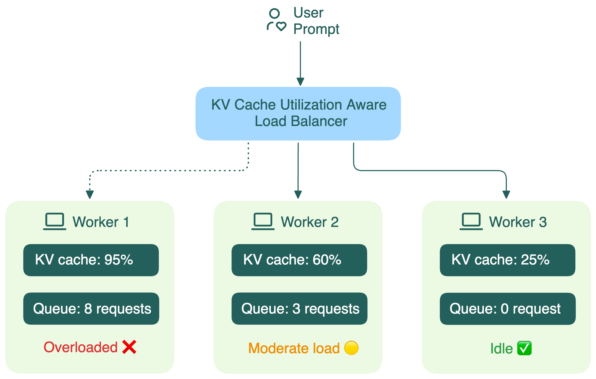

В традиционных веб-приложениях балансировка нагрузки обычно проста: запросы маленькие, ответы быстрые, любой бэкенд может обработать любой запрос одинаково хорошо. Балансировщики используют простые стратегии, например round-robin, чтобы равномерно распределять трафик.

В инференсе LLM всё иначе. Ключевой фактор — KV-кэш, который строится на этапе prefill.

Обычные балансировщики воспринимают LLM-воркеры как чёрные ящики. Они не видят, что происходит внутри:

- Сколько GPU-памяти занято под KV-кэш
- Какова длина очереди запросов

Если балансировщик не видит этих деталей, он начинает принимать неэффективные решения, что приводит к:

- **Потере переиспользования кэша**: новые запросы с похожими префиксами не могут использовать уже посчитанные KV-кэши (подробнее в следующем разделе).
- **Росту задержки**: если диалог попал не на ту реплику, KV-кэш теряется, и всё приходится пересчитывать заново.
- **Дисбалансу нагрузки**: одни воркеры обрабатывают много длинных диалогов, другие простаивают.

Open-source сообщество уже работает над более умными решениями. Например, проект [Gateway API Inference Extension](https://github.com/kubernetes-sigs/gateway-api-inference-extension) использует компонент endpoint picker (EPP), который собирает информацию об использовании KV-кэша, длине очереди и LoRA-адаптерах на каждом воркере, и направляет запросы на оптимальную реплику для лучшего инференса.