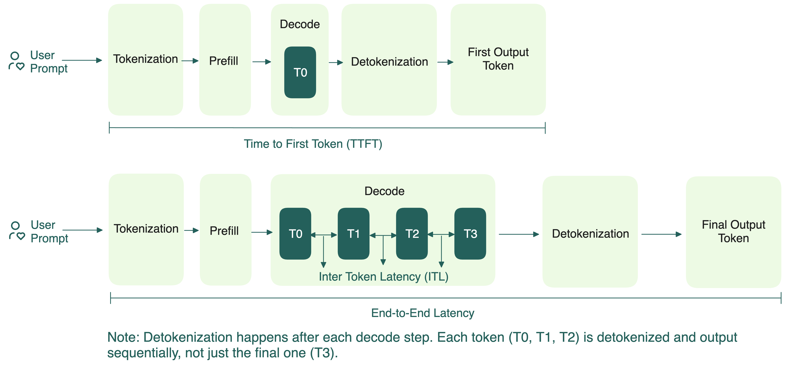



Прежде чем переходить к оптимизации, важно понять, какие метрики она затрагивает. Оценка производительности LLM включает разные инструменты, которые по-разному определяют, измеряют и считают эти метрики.


## Задержка (Latency)

Задержка показывает, как быстро модель отвечает на запрос. Это критично для пользовательского опыта, особенно в интерактивных и realtime-приложениях.

Ключевые метрики задержки:

- **Time to First Token (TTFT)**: время до генерации первого токена после отправки запроса. Показывает, как быстро модель начинает отвечать.
- **Total Latency (E2EL)**: время от отправки запроса до получения последнего токена на стороне пользователя. Влияет на ощущение "быстроты". Быстрый TTFT, но медленная генерация токенов всё равно портит опыт.
- **Token Generation Time**: время генерации всех токенов после первого (TTFT не учитывается, это только фаза стабильной генерации):

  $$
  	\text{Token Generation Time} = {\text{E2EL – TTFT}}
  $$

- **Time per Output Token (TPOT)**: средний промежуток между генерацией каждого следующего токена (без учёта TTFT). Чем ниже TPOT, тем быстрее модель выдаёт токены, выше TPS. Обычно считается так:
  
  $$
  	\text{TPOT} = \frac{\text{E2EL – TTFT}}{\text{Total Output Tokens} - 1}
  $$

  В потоковых сценариях (например, когда текст появляется по словам, как в ChatGPT) TPOT определяет плавность опыта. Система должна быть не медленнее скорости чтения человека.

- **Inter-Token Latency (ITL)**: точная пауза между двумя токенами.

  Для одного запроса среднее ITL совпадает с TPOT, поэтому **эти метрики иногда используют как синонимы**:

  $$
  	\text{Average ITL} = \text{TPOT} = \frac{\text{E2EL – TTFT}}{\text{Total Output Tokens} - 1}
  $$

  Для нескольких запросов разница — в способе усреднения:

  $$
  	\text{Average ITL} = \frac{\text{Sum of all ITLs across Requests}}{\text{Total Output Tokens across Requests}}
  $$

  В этом случае среднее ITL отличается от среднего TPOT, потому что последнее обычно считают так:

  $$
  	\text{Average TPOT} = \frac{\text{TPOT}_1 + \text{TPOT}_2 + \cdots + \text{TPOT}_N}{N}
  $$

  Читая бенчмарки, всегда смотрите, как определены TPOT и ITL. Разные фреймворки и статьи могут считать их по-разному, что влияет на интерпретацию результатов. В формулах выше:

  - **Average TPOT — взвешено по запросам**: удобно для сравнения задержки на запрос между системами. Каждый запрос равен, независимо от числа токенов.
  - **Average ITL — взвешено по токенам**: длинные ответы (больше токенов) влияют сильнее. Лучше для оценки общей пропускной способности и стабильной скорости стриминга.


    

Допустимая задержка зависит от задачи. Для чат-бота TTFT должен быть меньше 500 мс, чтобы казаться "живым"; для автодополнения кода — меньше 100 мс. Если же речь о генерации длинных отчётов раз в день, то и 30 секунд — нормально. Главное — соотносить цели по задержке с ожиданиями и ритмом задачи.


### Среднее, медиана и P99 задержки

Анализируя производительность LLM, особенно задержку, нельзя смотреть только на одну цифру. Среднее, медиана и P99 показывают разные стороны.

- **Среднее (Mean)**: сумма всех значений, делённая на их количество. Даёт общее представление, но чувствительно к выбросам. Например, если TTFT одного запроса очень велико, среднее "раздувается".
- **Медиана (Median)**: середина отсортированного ряда. Показывает "типичный" опыт пользователя, устойчива к выбросам. Если медиана TTFT — 30 секунд, значит большинство пользователей долго ждут первый ответ, что плохо для realtime.
- **P99 (99-й перцентиль)**: значение, ниже которого попадает 99% запросов. Показывает худший опыт для 1% самых медленных запросов. Важно для задач с требованиями к стабильности или SLA. Если P99 TTFT — почти 100 секунд, значит у части пользователей очень долгие ожидания.

> Иногда встречаются P90 или P95 — это 90-й и 95-й перцентили. Они полезны для оценки "почти худших" случаев и часто используются, если P99 слишком строг или чувствителен к шуму.


Вместе эти метрики дают полную картину:

- **Среднее** — для отслеживания трендов во времени.
- **Медиана** — отражает опыт большинства пользователей.
- **P99** — показывает "хвост" задержек, который может испортить или спасти опыт в продакшене.

В бенчмарках LLM часто встречаются mean TTFT, median TPOT, P99 E2EL — чтобы охватить разные стороны задержки и пользовательского опыта.
    
## Пропускная способность (Throughput)

Пропускная способность показывает, сколько работы LLM может выполнить за единицу времени. Высокий throughput важен для одновременного обслуживания многих пользователей или больших объёмов данных.

Есть два основных способа измерения throughput:

- **Requests per Second (RPS)**: сколько запросов LLM может успешно обработать за секунду. Считается так:
    
  ```bash
  Requests per second = Total completed requests / (T1 - T2)
  ```

>    Здесь T1 и T2 — границы временного окна в секундах.

  RPS даёт общее представление о том, как LLM справляется с параллельными запросами. Но эта метрика не учитывает сложность или размер запроса. Например, сгенерировать "Привет!" проще, чем длинное эссе.
    
  На RPS влияют:
    
  - Сложность и длина промпта
  - Размер модели и характеристики железа
  - Оптимизации (батчинг, кэширование, движки инференса)
  - Задержка на запрос
  
- **Tokens per Second (TPS)**: более точная метрика, показывает, сколько токенов обрабатывается в секунду по всем активным запросам. Бывает двух видов:
  - **Input TPS**: сколько входных токенов модель обрабатывает в секунду
  - **Output TPS**: сколько выходных токенов модель генерирует в секунду
    
  Оба показателя помогают выявить узкие места в зависимости от типа нагрузки. Например:
    
  - Для суммаризации длинных документов (2000 токенов на входе) важнее input TPS
  - Для чат-бота, который генерирует длинные ответы на короткие промпты (20 → 500 токенов), критичен output TPS
    
  В бенчмарках всегда уточняйте, о каком TPS идёт речь — input, output или суммарный. Это важно для корректной оценки.
    
  На TPS влияют:
    
  - Размер батча (чем больше, тем выше TPS — до насыщения)
  - Эффективность KV-кэша и использование памяти
  - Длина промпта и длина генерации
  - Пропускная способность памяти GPU и загрузка вычислений
    
  С ростом числа параллельных запросов общий TPS тоже растёт — пока LLM не упрётся в предел ресурсов. После этого производительность может даже падать из-за перегрузки.

---


## Goodput

**Goodput** — уточнённая версия throughput. Это число запросов в секунду, которые LLM успешно завершает с соблюдением заданных SLO (Service-Level Objective). Такая метрика полезнее для реальных систем, потому что напрямую отражает качество сервиса.

> **Service-Level Objective (SLO)** — целевой уровень для конкретной метрики. Это стандарт, что считается "приемлемым сервисом". Например, SLO для TTFT может требовать, чтобы 95% обращений к чат-боту имели TTFT меньше 200 мс. Обычно SLO — часть более широкой SLA между провайдером и пользователем.

Почему goodput важен? Высокий throughput не всегда означает хороший опыт: если не выполняются цели по задержке, многие ответы бесполезны. Goodput — это прямой показатель того, насколько система LLM реально достигает целей по производительности и пользовательскому опыту при ограничениях по задержке. Это помогает не попасть в ловушку: максимизировать throughput в ущерб реальному UX и экономике.


## Баланс между задержкой и пропускной способностью

При хостинге и оптимизации LLM всегда приходится балансировать между двумя целями: минимизировать задержку и максимизировать throughput. Вот что это значит:

| Цель | Последствия |
| --- | --- |
| Максимум throughput (TPS/MW) | Стремление выдать максимум токенов на ватт. Обычно это большие батчи и общее использование ресурсов, но может замедлить ответы отдельным пользователям. |
| Минимум задержки (TPS на пользователя) | Стремление дать каждому пользователю быстрый ответ (низкий TTFT). Обычно это маленькие батчи и изолированные ресурсы, но GPU используются менее эффективно. |
| Баланс | Некоторые системы динамически балансируют ресурсы в реальном времени по нагрузке, приоритету и требованиям приложения. Это оптимально для разных приложений с разными SLO. |

Чтобы найти лучший баланс, нужно настраивать важные "ручки" системы: Data Parallelism (DP), Tensor Parallelism (TP), Expert Parallelism (EP), размер батча, точность (FP8, FP4), дисагрегацию (разделение prefill и decode). Эти параметры напрямую влияют на то, насколько хорошо вы оптимизируете под низкую задержку, высокий throughput или компромисс. Подробнее — в следующем разделе.

Serverless API скрывает эти настройки, давая меньше контроля. Свой низкоуровневый стек позволяет гибко управлять компромиссом и подгонять производительность под SLO вашего приложения.


## Дополнительные ресурсы
  * [NVIDIA NIM LLMs Benchmarking - Metrics](https://docs.nvidia.com/nim/benchmarking/llm/latest/metrics.html)
  * [Mastering LLM Techniques: Inference Optimization](https://developer.nvidia.com/blog/mastering-llm-techniques-inference-optimization/)
  * [LLM-Inference-Bench: Inference Benchmarking of Large Language Models on AI Accelerators](https://arxiv.org/pdf/2411.00136)
  * [Throughput is Not All You Need](https://hao-ai-lab.github.io/blogs/distserve/)
