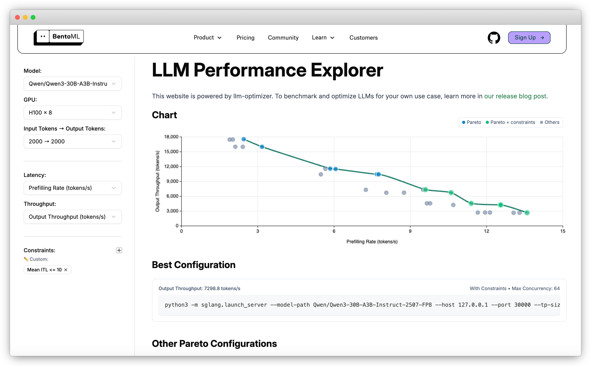

Вы наверняка видели лидерборды LLM — аккуратные таблицы, где модели ранжируются по разным метрикам. Это может быть полезной отправной точкой для понимания возможностей модели, но такие рейтинги легко вводят в заблуждение, если воспринимать их как единственный критерий выбора.

Бенчмаркинг LLM — сложная задача. Высокий балл на публичном бенчмарке не гарантирует, что модель будет хорошо работать именно под вашу нагрузку. Ваш продакшен-стек почти никогда не совпадает с тестовой средой из чужого рейтинга. Особенно это важно, если вы хотите оптимизировать под конкретный сценарий, например, добиться 120 токенов/сек при задержке не выше 300 мс.

Чтобы подобрать оптимальную конфигурацию под свои задачи, нужно запускать собственные бенчмарки производительности инференса LLM. Это требует продуманных тестов и часто — компромисса между throughput, latency и стоимостью.

## Какие бывают бенчмарки LLM

Когда говорят о бенчмарках LLM, обычно имеют в виду два разных типа:

- **Бенчмарки качества** — измеряют, насколько хорошо модель отвечает на вопросы, рассуждает, следует инструкциям. Примеры: MMLU, GSM8K, HumanEval, TruthfulQA. Именно такие метрики чаще всего лежат в основе публичных лидербордов.
- **Бенчмарки производительности** — измеряют, насколько быстро и эффективно модель работает в реальных условиях. Сюда входят throughput (токенов в секунду), latency (TTFT, медиана, P99), эффективность по стоимости, загрузка GPU.

Оба типа важны, но служат разным целям. Модель, которая занимает топовые места по качеству, может оказаться непригодной в продакшене из-за высокой задержки или дороговизны. А модель с отличной производительностью, но не самой высокой точностью, может быть лучшим выбором для задач, где важна скорость.

В этом разделе мы фокусируемся именно на бенчмарках производительности инференса LLM.

## Когда стоит запускать бенчмарки производительности

Вот ситуации, когда собственные бенчмарки действительно нужны:

- **Сравнение разных моделей**. Если выбираете между двумя топовыми LLM, бенчмарки покажут разницу по throughput, latency и стоимости именно под вашу нагрузку.
- **Оценка фреймворков инференса**. vLLM, SGLang, TensorRT-LLM, Hugging Face TGI реализуют разные оптимизации. Бенчмарки помогают понять, что лучше для вашей инфраструктуры.
- **Тестирование изменений инфраструктуры**. Переход с A10G на H100, миграция с on-prem в облако — всё это влияет на производительность. Бенчмарки подтверждают эффект.
- **Проверка оптимизаций**. Техники вроде [speculative decoding](./speculative-decoding), [prefix caching](./prefix-caching), [disaggregated serving](./prefill-decode-disaggregation), [KV cache offloading](./kv-cache-offloading) всегда нужно валидировать повторяемыми тестами.
- **Масштабирование под продакшен**. Перед запуском важно проверить систему под реальными нагрузками и параллелизмом.

В общем, бенчмарки нужны всегда, когда нужны доказательства, что выбранная конфигурация инференса реально отвечает вашим требованиям.

## Когда бенчмарки бесполезны

Вот ситуации, когда бенчмарки не дадут полезной информации:

- **Несовпадение с вашей нагрузкой**. Некоторые результаты получены на узких тестах. Если у вас длиннее промпты, выше параллелизм или жёстче требования по задержке — эти цифры не будут релевантны.
- **Нерелевантные датасеты**. Одни бенчмарки тестируют код, другие — математику, третьи — рассуждения. Если вы делаете чат-бота для поддержки, высокие баллы на GSM8K или HumanEval не имеют значения.
- **Другая инфраструктура**. Ваше железо, фреймворк или кэширование никогда не совпадут с условиями чужих рейтингов.
- **Фокус только на одной метрике**. Смотреть только на токены/сек или только на задержку — значит игнорировать компромиссы.
- **Игнорирование стоимости и масштабируемости**. Даже если модель быстрая на бумаге, в продакшене она может оказаться слишком дорогой или сложной.

Помните: бенчмарки — это справка, а не финальный критерий выбора.

## Как выбрать инструменты для бенчмаркинга

Существует множество способов тестировать производительность LLM, но не все инструменты одинаково полезны.

### Общие инструменты нагрузочного тестирования

[Locust](https://locust.io/) и [K6](https://k6.io/) — популярные инструменты для симуляции реального трафика. Они генерируют множество параллельных запросов, чтобы проверить, как ваша система справляется с нагрузкой и масштабируется. Помогают выявить узкие места в серверных ресурсах, автоскейлинге, сетевой задержке и использовании железа.

### Специализированные инструменты для LLM

[NVIDIA GenAI-Perf](https://docs.nvidia.com/deeplearning/triton-inference-server/user-guide/docs/perf_analyzer/genai-perf/README.html) и [LLMPerf](https://github.com/ray-project/llmperf) — инструменты, специально созданные для бенчмаркинга LLM. Они фокусируются на метриках инференса: throughput, latency и т.д. Разные инструменты могут по-разному считать метрики, поэтому важно читать документацию.

### Скрипты и утилиты в самих фреймворках

Некоторые фреймворки, например [vLLM](https://github.com/vllm-project/vllm/tree/main/benchmarks) и [SGLang](https://docs.sglang.ai/developer_guide/benchmark_and_profiling.html#), предоставляют свои скрипты и инструкции для бенчмаркинга. Это удобно для быстрых экспериментов и оценки оптимизаций конкретного фреймворка. Но всегда внимательно смотрите на параметры по умолчанию — результаты могут не отражать вашу продакшен-конфигурацию.

### End-to-end бенчмаркинг с llm-optimizer

[llm-optimizer](https://www.bentoml.com/blog/announcing-llm-optimizer) — open-source инструмент для бенчмаркинга и оптимизации инференса LLM. Он позволяет оценить поведение модели при разных параметрах сервера, клиента и фреймворка.

С помощью llm-optimizer можно:

- Запускать системные бенчмарки для разных фреймворков (SGLang, vLLM) с их родными аргументами
- Экспериментировать с оптимизациями: батчинг, параллелизм
- Задавать SLO и фильтровать только те конфигурации, что им соответствуют
- Оценивать производительность теоретически, без полного запуска
- Смотреть и сравнивать результаты на единой графической панели

Результаты бенчмарков LLM можно посмотреть в [LLM Performance Explorer](https://www.bentoml.com/llm-perf/), который работает на базе llm-optimizer.

## Какие метрики важно бенчмаркать

В бенчмарках инференса LLM нельзя ограничиваться одной цифрой. Реальная производительность зависит от множества метрик, между которыми всегда есть компромиссы. Самые важные:

- **Throughput** — сколько токенов или запросов в секунду может обработать/выдать модель. Показывает масштабируемость и "сырую" эффективность.
- **Latency** — как быстро модель отвечает на запрос. Ключевые метрики: TTFT, ITL, медиана, хвостовые задержки (P95, P99). Именно они определяют, насколько "живой" кажется LLM для пользователя.
    
  Подробнее см. [метрики инференса LLM](./llm-inference-metrics).
    
- **Стоимость** — обычно считается как цена за тысячу токенов, за запрос или за единицу времени. Для self-hosted инференса основная статья расходов — GPU. Многие топовые LLM требуют дорогих и мощных GPU.
- **Использование ресурсов** — загрузка GPU/CPU, использование памяти, hit rate кэша. Высокая загрузка — это обычно лучшая эффективность железа. В продакшене это напрямую влияет на стоимость токена.

Результаты бенчмарка сильно зависят от того, как он проведён. Важно контролировать:

- **Параметры сервера**: параллелизм (data, tensor, expert), кэширование, выделение памяти
- **Параметры клиента**: частота запросов, лимиты параллелизма, размер батча, таймауты
- **Различия фреймворков**: оптимизации в vLLM, SGLang, TensorRT-LLM, TGI и др.
- **Вариации нагрузки**: выбор модели, длина входа/выхода, распределение запросов

Иногда даже небольшие отличия в этих параметрах радикально меняют результаты.

## Как делать хорошие бенчмарки LLM

Бенчмаркинг LLM сложнее, чем кажется. Цифры вроде "200 токенов/сек" звучат просто, но без контекста почти ничего не значат. Настоящий бенчмаркинг должен фиксировать окружение, нагрузку и ограничения, чтобы результаты были воспроизводимы и релевантны.

Вот пример шаблона бенчмарка (данные условные):

| Категория | Параметр | Значение |
| --- | --- | --- |
| **Модель** | Название | `meta-llama/Llama-3.1-8B-Instruct` |
|  | Фреймворк | `vLLM 0.4.2` |
|  | Квантование | `FP16` |
| **Железо** | GPU | `4 x NVIDIA A10G` |
|  | Память GPU | `24 GB` |
| **Конфиг сервера** | Tensor Parallelism | `1` |
|  | Data Parallelism | `4` |
|  | Max Batch Size | `16` |
| **Конфиг клиента** | Request Rate | `50 req/s` |
|  | Параллелизм | `16` |
|  | Длина входа | `256 токенов` |
|  | Длина выхода | `512 токенов` |
| **Результаты** | Throughput | `98 токенов/сек` |
|  | Median TTFT | `210 мс` |
|  | P99 Latency | `1.4 с` |
|  | GPU Utilization | `89%` |
|  | Стоимость за 1M токенов | `$0.52` |

Советы по использованию шаблона:

- Всегда фиксируйте версию фреймворка и тип железа. Даже небольшие отличия могут сильно повлиять на результат.
- Указывайте длину входа/выхода — это сильно влияет на throughput и latency.
- Perceived tokens/sec (видимая пользователю скорость) часто важнее, чем "сырая" скорость генерации.
- Метрики стоимости делайте однородными: за запрос, за тысячу или миллион токенов.

## Дополнительные ресурсы
  * [LLM Performance Explorer](https://www.bentoml.com/llm-perf/)
  * [llm-optimizer: An Open-Source Tool for LLM Inference Benchmarking and Performance Optimization](https://www.bentoml.com/blog/announcing-llm-optimizer)
  * [Benchmarking LLM Inference Backends](https://www.bentoml.com/blog/benchmarking-llm-inference-backends)
