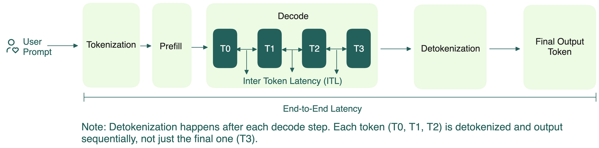

Чтобы понять, что такое дисагрегация prefill-decode (PD), напомним, как устроен инференс LLM в двух фазах:

- **Prefill**: обрабатывает всю последовательность сразу и сохраняет ключи и значения (KV) из attention-слоёв в KV-кэш. Поскольку обрабатываются все токены разом, prefill нагружает вычисления, но не сильно требует памяти GPU.
- **Decode**: генерирует выходные токены по одному, используя ранее построенный KV-кэш. В отличие от prefill, decode требует быстрой памяти, но меньше вычислений.

Долгое время стандартный инференс выполнял эти две фазы вместе. На первый взгляд, это просто.

На практике часто бывает много параллельных запросов. У каждого — свои prefill и decode, но одновременно может идти только одна фаза. Если GPU занят тяжёлым prefill, decode ждёт (и наоборот), что увеличивает ITL.

Поскольку prefill определяет TTFT, а decode влияет на ITL, совмещение их мешает оптимизировать обе метрики одновременно.

")

## Зачем нужна дисагрегация

Суть PD-дисагрегации проста: разделить две разные задачи, чтобы они не мешали друг другу. Ключевые плюсы:

- **Выделение ресурсов**: prefill и decode можно планировать и масштабировать независимо, даже на разном железе. Например, если у вас много перекрывающихся промптов (мульти-туровые диалоги, агентные пайплайны), большая часть KV-кэша переиспользуется. Тогда вычислений на prefill нужно меньше, а decode можно выделить больше ресурсов.
- **Параллельное выполнение**: prefill и decode больше не мешают друг другу. Их можно запускать параллельно, что даёт выше параллелизм и throughput.
- **Независимая оптимизация**: можно применять разные техники оптимизации (tensor/pipeline parallelism) для prefill и decode, чтобы лучше достигать целей по TTFT и ITL.

Ряд open-source фреймворков и проектов уже исследуют PD-дисагрегацию: [SGLang](https://github.com/sgl-project/sglang/issues/4655), [vLLM](https://docs.vllm.ai/en/latest/features/disagg_prefill.html), [Dynamo](https://docs.nvidia.com/dynamo/latest/architecture/disagg_serving.html), [llm-d](https://docs.google.com/document/d/1FNN5snmipaTxEA1FGEeSH7Z_kEqskouKD1XYhVyTHr8/edit?pli=1&tab=t.0).

## Дисагрегация — не всегда серебряная пуля

Несмотря на плюсы, PD-дисагрегация — не универсальное решение.

- **Порог важен**: если нагрузка слишком мала или GPU не настроены под этот подход, производительность может даже упасть (в тестах — на 20–30%).
- **Локальный prefill может быть быстрее**: для коротких промптов или при высоком hit rate кэша на decode-воркере проще и быстрее делать prefill локально.
- **Стоимость передачи данных**: дисагрегация требует быстрой и надёжной передачи KV-кэшей между prefill- и decode-воркерами. Нужно поддерживать быстрые, низколатентные протоколы, независимые от железа и сети. Если выигрыш от дисагрегации меньше, чем издержки на передачу данных, итоговая производительность может даже снизиться. Примеры решений: [NVIDIA Inference Xfer Library (NIXL)](https://github.com/ai-dynamo/nixl), CXL, NVMe-oF.

## Дополнительные ресурсы
  * [DistServe: Disaggregating Prefill and Decoding for Goodput-optimized Large Language Model Serving](https://arxiv.org/abs/2401.09670)
  * [SARATHI: Efficient LLM Inference by Piggybacking Decodes with Chunked Prefills](https://arxiv.org/pdf/2308.16369)
