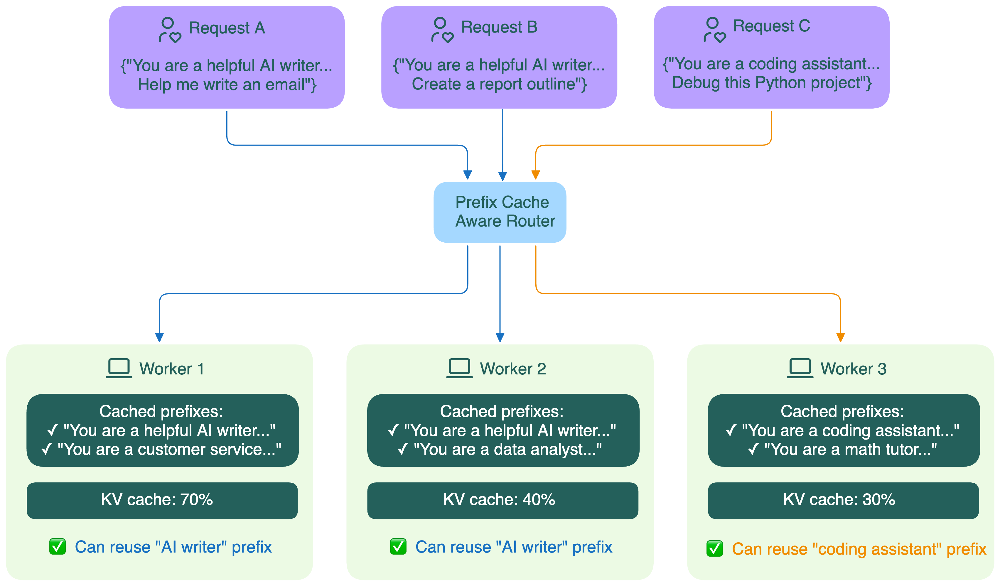

# Маршрутизация с учётом префикса

На практике применение [кэширования префикса](./prefix-caching) в распределённых системах связано с рядом сложностей. Например:

- Как направить новый запрос на тот воркер, где уже есть нужный кэш префикса?
- Как маршрутизатору узнать, что именно закэшировано у каждого воркера?

Разные open-source проекты предлагают свои подходы к маршрутизации с учётом префикса:

- **Статус префикса, сообщаемый воркером**
    
    В [Dynamo](https://github.com/ai-dynamo/dynamo) сами воркеры активно сообщают, какие префиксы у них закэшированы. Маршрутизатор использует эти данные в реальном времени для умного распределения запросов.
    
- **Статус кэша, предсказываемый маршрутизатором**
    
    В [SGLang](https://github.com/sgl-project/sglang) маршрутизатор ведёт приближённое radix-дерево для каждого воркера на основе истории запросов. Это позволяет предсказывать, у кого с большей вероятностью есть нужный префикс, без постоянных апдейтов от воркеров.
    
- **Гибридные подходы**
    - В проекте Gateway API Inference Extension [рассматривается несколько стратегий реализации маршрутизации на EPP](https://github.com/kubernetes-sigs/gateway-api-inference-extension/issues/498):
        - **Consistent hashing по префиксу**: группировка запросов с похожими префиксами на одном воркере.
        - **Приближённый кэш префиксов на маршрутизаторе**: маршрутизатор ведёт приближённый индекс кэшей всех бэкендов.
        - **Точный кэш префиксов на маршрутизаторе**: маршрутизатор собирает информацию о KV-кэше, которую сообщают серверы моделей.
    - В [llm-d](https://github.com/llm-d/llm-d) используется компонент Inference Scheduler, который реализует фильтрацию и скоринг, а решения о маршрутизации принимает на основе сочетания факторов: наличие кэша, статус prefill/decode, SLA, нагрузка.