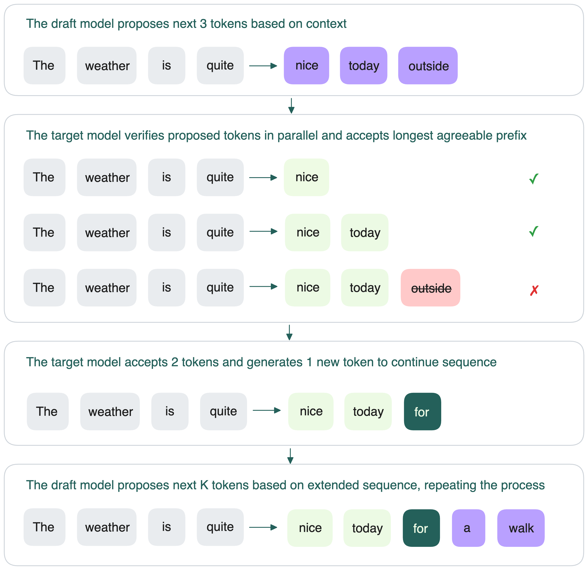
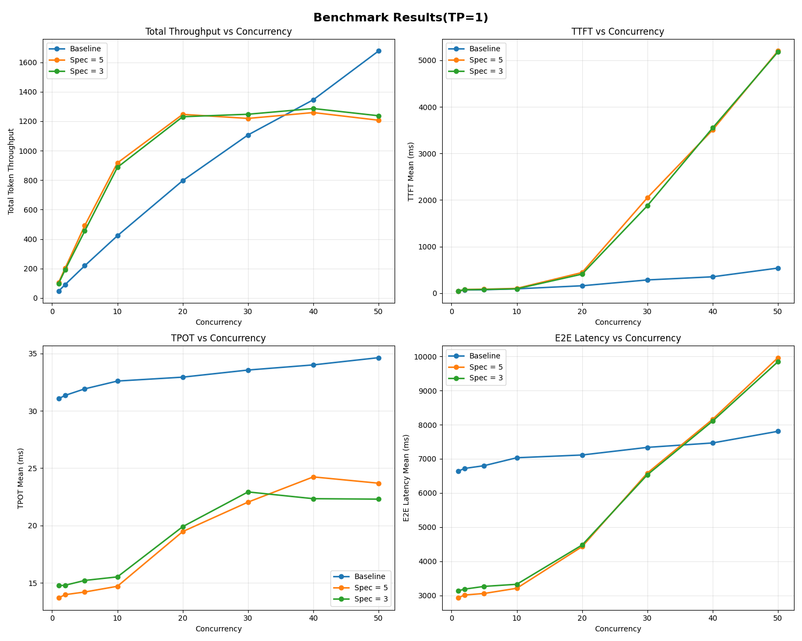
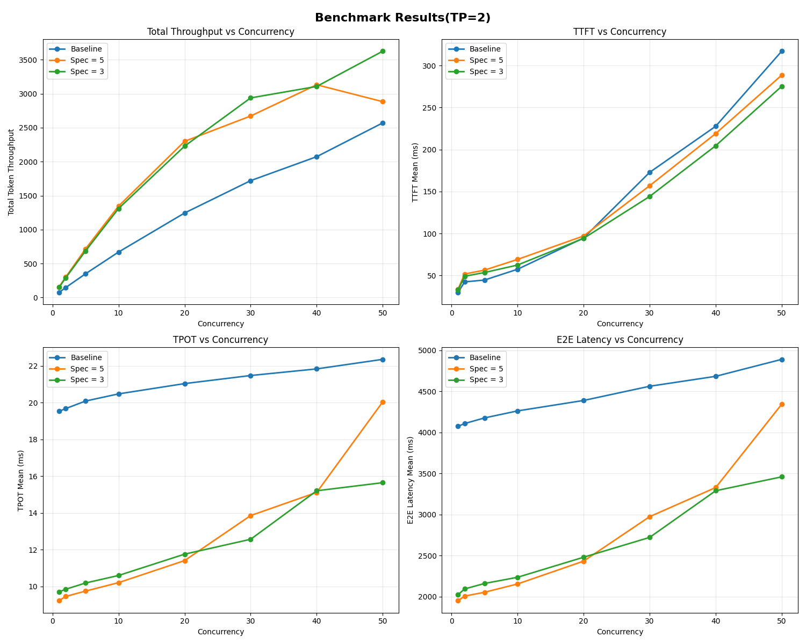



Speculative decoding — это оптимизация инференса, которая ускоряет генерацию токенов LLM без потери качества вывода. Она работает с двумя моделями:

- **Draft-модель**: меньшая и быстрая, предлагает несколько токенов "вперёд".
- **Target-модель**: большая, проверяет предложенные токены параллельно и принимает те, что совпадают с её собственными предсказаниями.

Этот паттерн "сначала черновик — потом проверка" гарантирует, что итоговый вывод будет точно таким же, как если бы target-модель работала одна. Качество не страдает.

С правильно подобранной draft-моделью можно получить **ускорение инференса LLM до 3 раз** благодаря speculative decoding.
## Зачем нужен speculative decoding

[LLM на трансформерах генерируют текст авторегрессивно](../llm-inference-basics/how-does-llm-inference-work#the-two-phases-of-llm-inference): по одному токену за раз, каждый следующий зависит от предыдущих. Каждый новый токен требует полного прохода по модели, сэмплинга и добавления токена к входу перед следующим шагом.

У этого последовательного процесса две главные проблемы:

- **Высокая межтокенная задержка (ITL)**: [задержка между токенами](./llm-inference-metrics) делает генерацию медленной.
- **Плохая загрузка GPU**: модель не может заранее считать будущие токены, даже если GPU простаивает.

А что если можно распараллелить хотя бы часть процесса?

Вдохновлённый speculative execution (вычисления "на опережение" с отбрасыванием ненужного), speculative decoding позволяет параллелить часть генерации токенов. Когда target-модель проверяет сразу несколько draft-токенов, GPU используется эффективнее, а ITL снижается. Особенно полезно для задач с критичной задержкой: чат-боты, автодополнение кода и др.

Техника основана на [двух ключевых наблюдениях о LLM-инференсе](https://research.google/blog/looking-back-at-speculative-decoding/):

1. **Инференс LLM упирается в память**. У GPU огромные вычислительные мощности, но ограниченная пропускная способность памяти. Большая часть вычислений простаивает, ожидая память.
2. **Некоторые токены легко предсказать**. Многие следующие токены очевидны из контекста и могут быть предложены меньшей моделью.

Идея draft-then-verify впервые предложена в [Stern et al. (2018)](https://arxiv.org/abs/1811.03115), а затем [развита DeepMind](https://arxiv.org/pdf/2302.01318) в метод **Speculative Sampling**. Speculative decoding — это применение speculative sampling к инференсу автогрегрессивных моделей (трансформеров).
## Как работает speculative decoding

В общих чертах speculative decoding работает в цикле:

1. Draft-модель предсказывает следующие *K токенов* после входной последовательности.
2. Target-модель проверяет эти *K токенов* параллельно: совпадают ли они с её собственными предсказаниями.
3. Target-модель принимает самый длинный префикс из этих *K токенов*, с которым она согласна.
4. Если принято *h* токенов, target сама генерирует *(h+1)*-й токен (чтобы не сбиться с последовательности).
5. Процесс повторяется: draft-модель предлагает следующие *K токенов* уже для нового расширенного контекста.

## Как оценивать производительность speculative decoding

Speculative decoding может ускорить инференс LLM, но только если draft- и target-модели хорошо согласуются. Перед внедрением в продакшен всегда бенчмаркните производительность под свою нагрузку. Фреймворки vLLM и SGLang поддерживают эту оптимизацию "из коробки".

### Ключевые метрики

При оценке speculative decoding важны три метрики:

- **Acceptance rate (α)**: вероятность того, что target-модель примет draft-токен. Зависит от стратегии декодирования (nucleus, random sampling и др.) и предметной области.
    
    Высокое α — больше токенов принимается за раунд, меньше проходов по target-модели. Это снижает задержку, увеличивает throughput и загрузку GPU. Низкое α — много токенов отклоняется, тратится вычисления впустую, чаще приходится возвращаться к последовательному декодированию.
    
- **Speculative token count (γ)**: сколько токенов draft-модель предлагает за шаг. Обычно настраивается во фреймворках.
- **Acceptance length (τ)**: среднее число принятых токенов за раунд. По статье [Fast Inference from Transformers via Speculative Decoding](https://arxiv.org/pdf/2211.17192) считается по формуле:

    $$
    \tau = \frac{1 - \alpha^{\gamma+1}}{1 - \alpha}
    $$
    
### Как acceptance rate влияет на производительность

В теории эффективность speculative decoding сильно зависит от acceptance rate. Для изучения этого команда Bento пропатчила vLLM, чтобы симулировать speculative decoding при разных α и γ (без draft-модели, target принимает токены с заданной вероятностью).

Вот основные выводы:

1. Чем выше α, тем больше ускорение.
2. Рост γ помогает только при высоком τ; иначе производительность может даже ухудшиться.
3. Задержка падает, а throughput растёт почти линейно с α.
4. При α ≥ 0.6 и γ ≥ 5 speculative decoding даёт ускорение в 2–3 раза по сравнению с обычным декодированием.

На практике ускорение оказалось ниже ожидаемого. [Подробнее в этом блоге](https://www.bentoml.com/blog/3x-faster-llm-inference-with-speculative-decoding).
### Как производительность меняется при разных нагрузках

Команда Bento также тестировала speculative decoding при разном уровне параллелизма и tensor parallelism (TP).

При TP = 1 общий throughput выходит на плато раньше (20–30 параллельных запросов), чем в базовой схеме. Это говорит о том, что координация между draft- и target-моделями даёт overhead при высокой нагрузке. Тем не менее, Time Per Output Token (TPOT) улучшился примерно в 2 раза.

При TP = 2 производительность speculative decoding выросла, прирост throughput стал заметнее. Однако при большом γ (γ = 5) наблюдались всплески задержки при высокой конкуренции (40+ запросов).

В целом, speculative decoding снижает TPOT при разных нагрузках. Добавление параллелизма (TP = 2) увеличивает throughput, но γ нужно подбирать, чтобы избежать всплесков задержки при большой нагрузке.

> Эти результаты — неформальные тесты, только для ориентира. Производительность зависит от вашей модели, железа, нагрузки и фреймворка. Всегда бенчмаркните speculative decoding под свои условия перед внедрением в продакшен.
## Советы по использованию speculative decoding

Speculative decoding может дать реальный прирост, но только если правильно его настроить. Важно понимать, где он помогает, а где может навредить.

### Следите за расходом памяти

Вам нужно загрузить в память GPU и draft-, и target-модель. На одной GPU это быстро "съедает" место для других задач (например, батчинг) и может ухудшить производительность при большой нагрузке или крупных моделях.

В мульти-GPU (TP > 1) ситуация лучше: разделение моделей по GPU снижает узкие места. В тестах выше speculative decoding с γ = 3 или γ = 5 давал прирост даже при 50 параллельных запросах.

### Не игнорируйте бесполезные вычисления

Если target-модель отклоняет слишком много draft-токенов, GPU всё равно тратит время на их генерацию и проверку. Эта работа не приносит пользы и сводит на нет ускорение. Поэтому acceptance rate так важен.

### Подберите правильную draft-модель

Насколько распределение draft-модели совпадает с target-моделью, настолько высок acceptance rate. Готовые draft-модели иногда работают "из коробки", но часто плохо справляются с задачами в специфичных доменах или на длинных контекстах.

Если у вашей нагрузки есть особенности, скорее всего, лучше [дотренировать draft-модель на своих данных](https://www.bentoml.com/blog/3x-faster-llm-inference-with-speculative-decoding). Так она научится лучше имитировать target, что повысит acceptance rate и ускорение. Если же и так всё хорошо — можно не тренировать и всё равно получить прирост.
## Дополнительные ресурсы
  * [Get 3× Faster LLM Inference with Speculative Decoding Using the Right Draft Model](https://www.bentoml.com/blog/3x-faster-llm-inference-with-speculative-decoding)
  * [Looking back at speculative decoding](https://research.google/blog/looking-back-at-speculative-decoding/)
  * [EAGLE: Speculative Sampling Requires Rethinking Feature Uncertainty](https://arxiv.org/pdf/2401.15077)
  * [Fast Inference from Transformers via Speculative Decoding](https://arxiv.org/abs/2211.17192)
  * [Accelerating Large Language Model Decoding with Speculative Sampling](https://arxiv.org/abs/2302.01318)
  * [Blockwise Parallel Decoding for Deep Autoregressive Models](https://arxiv.org/abs/1811.03115)
