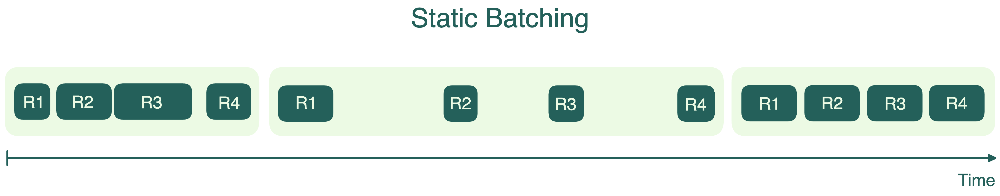
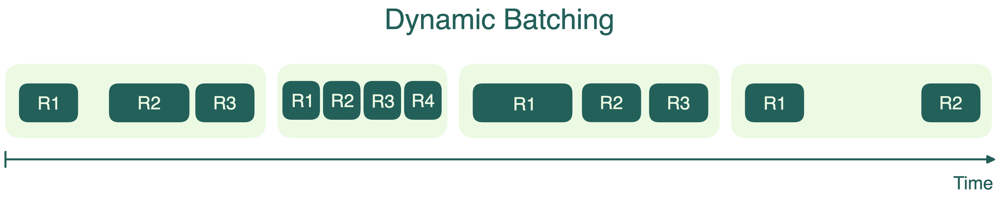

GPU созданы для высокопараллельных вычислений и способны выполнять триллионы или даже квадриллионы операций с плавающей запятой в секунду (FLOPs). Тем не менее, LLM часто не могут полностью загрузить GPU, потому что значительная часть пропускной способности памяти уходит на загрузку параметров модели.

Батчинг помогает снизить этот узкий момент. В продакшене ваш сервис может получать множество запросов одновременно. Вместо того чтобы обрабатывать каждый запрос по отдельности, объединение их в батч позволяет использовать уже загруженные параметры модели для всех запросов сразу, что резко увеличивает throughput.

## Статический батчинг

Самая простая форма — **статический батчинг**. Сервер ждёт, пока наберётся фиксированное число запросов, и обрабатывает их все вместе одним батчем.

Статический батчинг легко реализовать, но у него есть существенные минусы:

- Первый запрос в батче вынужден ждать, пока придёт последний, что добавляет лишнюю задержку. Представьте принтер, который начнёт печатать только когда вы поставите в очередь определённое количество документов, независимо от того, сколько времени потребуется для последнего.
- Не все запросы одинаковы. В инференсе LLM одни запросы могут требовать очень коротких ответов, другие — длинных рассуждений. Все запросы в батче ждут, пока завершится самый долгий, что приводит к неэффективному использованию ресурсов и росту задержки.

## Динамический батчинг

Чтобы решить проблемы статического батчинга, многие системы используют **динамический батчинг**. Здесь запросы тоже собираются в батчи, но размер батча не фиксирован. Вместо этого задаётся временное окно, и все запросы, пришедшие за это время, объединяются в батч. Если лимит по размеру достигается раньше — батч отправляется сразу. Это как автобус, который уезжает по расписанию или когда заполнится, что наступит раньше.

Динамический батчинг помогает балансировать throughput и задержку. Он не даёт ранним запросам ждать слишком долго из-за поздних. Но иногда батчи запускаются не полностью заполненными, и это не всегда даёт максимум эффективности GPU. Кроме того, как и при статическом батчинге, самый длинный запрос в батче определяет, когда батч завершится — короткие запросы вынуждены ждать.

## Непрерывный батчинг

В инференсе LLM длина выходных последовательностей может сильно различаться. Кто-то задаёт короткие вопросы, кто-то — длинные. Статический и динамический батчинг заставляют короткие запросы ждать самых длинных, из-за чего GPU простаивает.

Непрерывный батчинг (continuous batching, или in-flight batching) решает эту проблему. Он не требует, чтобы весь батч завершился одновременно. Каждая последовательность в батче может завершиться независимо, и на её место сразу подставляется новая. Это похоже на конвейер: как только один предмет готов (неважно, сколько времени заняло), на его место ставят следующий, чтобы линия работала без простоев.

> Генерация семи последовательностей с непрерывным батчингом. На первой итерации (слева) каждая последовательность получает токен (синий) из промпта (жёлтый). Со временем (справа) последовательности завершаются на разных итерациях, выдавая end-of-sequence токен (красный), после чего на их место подставляются новые. [Источник изображения](https://www.anyscale.com/blog/continuous-batching-llm-inference)

В этой технике используется поиттерационный (iteration-level) планировщик: состав батча меняется динамически на каждой итерации декодирования. Как только последовательность завершила генерацию, сервер подставляет новый запрос. Это максимизирует загрузку GPU и не даёт вычислительным ресурсам простаивать в ожидании самого долгого запроса.

Большинство [фреймворков инференса](../getting-started/choosing-the-right-inference-framework) — vLLM, SGLang, TensorRT-LLM (in-flight batching), LMDeploy (persistent batching), Hugging Face TGI — поддерживают непрерывный батчинг или его аналоги.

## Дополнительные ресурсы
  * [How continuous batching enables 23x throughput in LLM inference while reducing p50 latency](https://www.anyscale.com/blog/continuous-batching-llm-inference)
  * [Mastering LLM Techniques: Inference Optimization](https://developer.nvidia.com/blog/mastering-llm-techniques-inference-optimization/)
