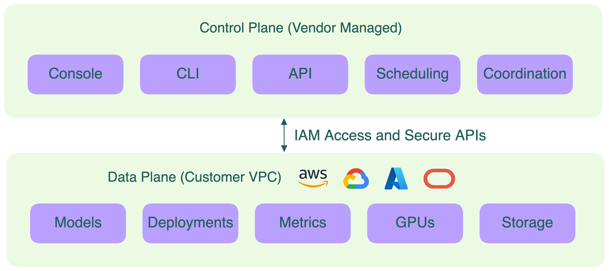

Команды корпоративного AI сталкиваются с задачей: как быстро масштабировать инференс LLM, не теряя контроля над данными, инфраструктурой и расходами.

Большинство организаций начинают с SaaS-платформ инференса, потому что их легко развернуть и они полностью управляемы. Но по мере роста нагрузок такие платформы становятся дорогими и ограничивающими.

- Ваши данные покидают ваш приватный облачный контур (VPC)
- Вы не знаете реальную стоимость GPU-ресурсов
- Проходить проверки на соответствие становится сложнее

В этом и помогает BYOC.

## Что такое BYOC?

BYOC (Bring Your Own Cloud, «развёртывание в своём облаке») — это модель, при которой вы запускаете ПО поставщика (например, платформу инференса LLM) прямо в своей облачной учётной записи. Вы получаете удобство управляемой оркестрации, сохраняя полный контроль над вычислениями, данными и сетями.

Эта модель особенно важна для современной AI-инфраструктуры. С одной стороны, инструменты и модели развиваются так быстро, что строить и поддерживать весь стек инференса внутри компании — значит тормозить инновации и выход на рынок. С другой — вы хотите контролировать, где и как работают ваши нагрузки, особенно если они обрабатывают чувствительные данные.

BYOC решает эту дилемму: организации сохраняют контроль над данными, безопасностью и операциями, но пользуются преимуществами управляемой оркестрации. То есть можно двигаться быстро, не жертвуя комплаенсом и суверенитетом.

Проще всего представить так:

- **SaaS**: всё запускает вендор.
- **On-prem**: всё запускаете вы.
- **BYOC**: вендор запускает ПО в вашем облаке, по вашим правилам.

BYOC начинался как нишевый вариант для компаний с высокими требованиями к данным. Сейчас это становится стандартом для крупных AI- и LLM-нагрузок.

## Как работает BYOC?

В BYOC ответственность делится между вами и вендором. Вендор управляет control plane, а компоненты data plane полностью остаются в вашем облаке. Вы отвечаете за свои облачные ресурсы (часть задач может делегироваться вендору), IAM-права и сетевые настройки для безопасности и надёжности. В идеале вендор не имеет прямого доступа к вашим данным или приватной сети.

Обычно схема такая:

1. **Control plane (управляется вендором)**: отвечает за координацию деплоя, масштабирование, расписание, обновления и т.д. Общается с вашей средой через защищённые API.
2. **Data plane (управляется клиентом)**: здесь происходит инференс. Ваши модели, GPU, вычислительные ресурсы и данные находятся в вашем VPC — это гарантирует комплаенс, приватность и изоляцию.
3. **Сетевые и IAM-границы**: BYOC строится на строгих правах доступа. Вендор может управлять деплоем программно (например, через IAM-ролли или кросс-аккаунт доступ), но не может просматривать или забирать данные. Логи (доступ к ним может быть у вендора для отладки), метрики и результаты моделей остаются в вашей среде.

Такой гибридный подход даёт лучшее из двух миров:

- Простота управляемой платформы для оркестрации и обновлений.
- Гарантия, что ваши LLM-нагрузки, данные и GPU под вашим контролем.

> [!NOTE]
> Реализация BYOC может отличаться в зависимости от требований организации. Например, в оборонке или здравоохранении может требоваться полный контроль и над control plane, и над data plane — для максимальной безопасности и комплаенса, часто в изолированных или air-gapped средах.

Современные системы инференса (vLLM, SGLang, BentoML) органично вписываются в эту модель: они работают на вашей инфраструктуре, но подключаются к централизованному control plane.

## Преимущества BYOC для LLM-нагрузок

Плюсы BYOC выходят далеко за рамки комплаенса. Вот ключевые преимущества:

### Суверенитет данных и соответствие требованиям

LLM широко используются в корпоративных системах — RAG, AI-агенты и др. Такие приложения часто требуют доступа к чувствительной информации (например, к данным клиентов), которую нельзя выносить за пределы приватной сети.

С BYOC все входные и выходные данные моделей, а также логи, остаются в вашем VPC и облачном регионе. Ничего не покидает вашу среду, если вы сами этого не захотите. Это сильно упрощает соответствие требованиям (например, GDPR) и внутренним аудитам безопасности.

Для организаций из финансового, медицинского и госсектора такой уровень контроля обязателен.

### Гибкость и доступность GPU

Инференс LLM сильно зависит от GPU, а их наличие и цены меняются по регионам и провайдерам. Многие вендоры поддерживают мультиоблачную архитектуру BYOC: вы сами выбираете, где запускать нагрузки — AWS, GCP, Azure или всё вместе.

Это значит, что вы можете:

- Выбрать облако с лучшей доступностью и ценой на GPU для ваших задач
- Использовать региональные скидки и акции
- Комбинировать разные типы GPU (например, NVIDIA A100, H100 или AMD MI300X) под нужды по цене и производительности

Эта гибкость гарантирует, что вы не останетесь без ресурсов и не будете переплачивать за вычисления.

### Оптимизация затрат и эффективность

С BYOC инференс работает в той же среде, где и ваши данные, что снижает дорогие расходы на передачу данных между облаками. Для команд, обрабатывающих большие датасеты, это может дать значительную экономию.

Это также позволяет максимально использовать существующие облачные инвестиции:

- Использовать кредиты или стартап-программы прямо в своей учётной записи
- Применять скидки за обязательство, планы экономии или спотовые цены к инференсу
- Агрегировать расходы по нагрузкам, чтобы получить корпоративные скидки от провайдера

### Нет привязки к вендору

BYOC делает вашу инфраструктуру облачно-нейтральной. Вы не привязаны к стеку или железу одного провайдера. Значит, ваша стратегия развёртывания LLM защищена на будущее: по мере роста потребностей вы свободно переносите нагрузки между облаками, GPU и инструментами оркестрации.

## SaaS vs. BYOC vs. On-prem vs. Гибрид

Выбор способа развёртывания LLM — это вопрос о том, где живут ваши модели и кто управляет инфраструктурой. Каждая модель — SaaS, BYOC, On-prem или гибрид (On-prem + BYOC) — даёт свой баланс между контролем, стоимостью и сложностью.

Вот краткое сравнение:

| Модель | Где работает | Кто управляет инфраструктурой | Контроль данных | Лучше всего подходит для |
| --- | --- | --- | --- | --- |
| SaaS | Облако вендора | Вендор | Низкий: данные в мультиарендной среде вендора | Быстрый старт, минимум опер. затрат, прототипирование, несекретные данные |
| BYOC | Облако клиента (AWS, GCP, Azure) | Совместно вендор и клиент | Высокий: данные в VPC клиента | Предприятия с требованиями безопасности/комплаенса, оптимизация GPU, гибкое масштабирование |
| [On-prem](./on-prem-llms) | Частный дата-центр клиента | Клиент | Полный: данные и вычисления только у клиента | Изолированные/строго регулируемые отрасли (оборона, медицина) |
| [Гибрид (On-prem + BYOC)](./on-prem-llms#overflowing-to-the-cloud-a-hybrid-approach) | Разделено между дата-центром и облаком | Совместно клиент и вендор | Полный: on-prem для чувствительных задач, облако для пиков | Организации, которым нужна гибкость при строгих границах данных |

Для большинства корпоративных LLM-нагрузок BYOC — лучший компромисс: быстро, безопасно по умолчанию и экономично в масштабе. Гибридные архитектуры становятся мостом между полным контролем и глобальной гибкостью: можно держать модели on-prem для максимального контроля и безопасности, а при всплесках трафика использовать облачные GPU. Подробнее — в [блоге о GPU CAP Theorem](https://www.bentoml.com/blog/how-to-beat-the-gpu-cap-theorem-in-ai-inference).

---

## Часто задаваемые вопросы

### Может ли BYOC работать с мультиоблачными или гибридными деплоями?

Да. BYOC естественно вписывается в гибридные и мультиоблачные архитектуры. В зависимости от вашей политики безопасности и комплаенса, чувствительные нагрузки могут оставаться on-prem или в одном облаке, а избыточный или глобальный трафик инференса масштабироваться в другие.

### Чем BYOC отличается от SaaS?

В SaaS вендор хостит и управляет всем в своей среде. В BYOC вендор управляет control plane, а data plane работает в вашем облаке. Вы сохраняете владение вычислительными, хранилищными и сетевыми ресурсами.

### Каковы компромиссы BYOC?

Вы получаете больше суверенитета и гибкости, но берёте на себя часть операционной нагрузки: управление облачной средой, IAM-ролями и мониторингом. Многие команды компенсируют это, используя управляемые решения BYOC, такие как Bento BYOC.

## Дополнительные ресурсы
  * [BYOC to BentoCloud: Privacy, Flexibility, and Cost Efficiency in One Package](https://www.bentoml.com/blog/byoc-to-bentocloud-privacy-flexibility-and-cost-efficiency-in-one-package)
  * [How to Beat the GPU CAP Theorem in AI Inference](https://www.bentoml.com/blog/how-to-beat-the-gpu-cap-theorem-in-ai-inference)
